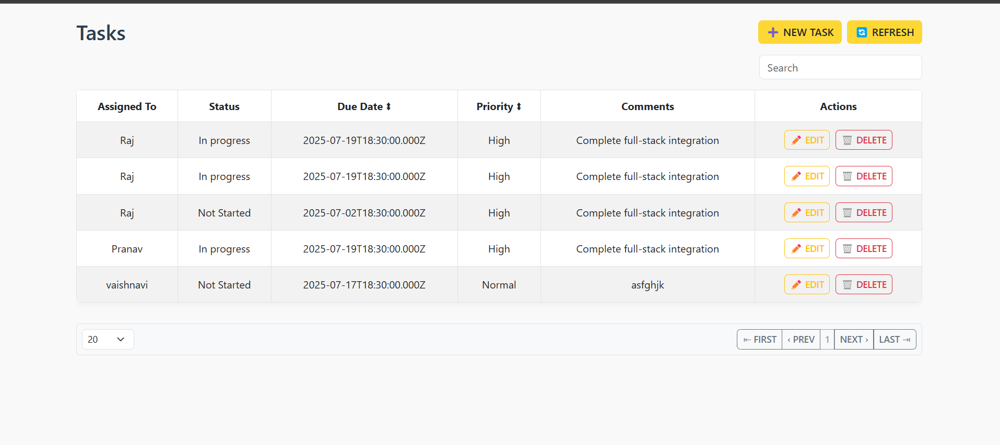
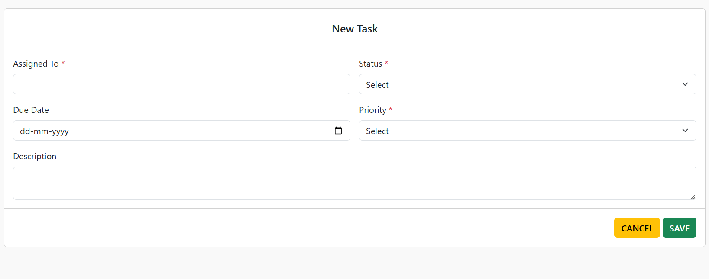
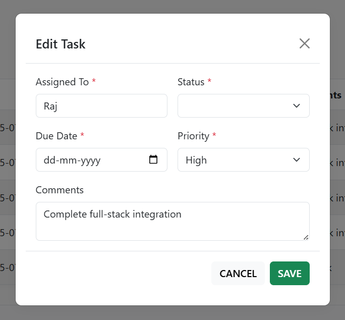
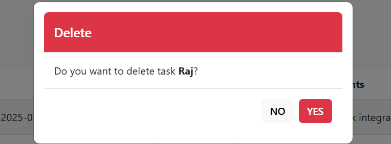

# 📝 Full-Stack To-Do List App

This is a responsive **To-Do List web application** built using:

- **Frontend:** HTML, CSS, Bootstrap, JavaScript  
- **Backend:** Node.js with Express  
- **Database:** MySQL via XAMPP

---

## 🚀 Features

- ➕ Add, ✏️ Edit, 🗑️ Delete tasks
- 🔍 Search functionality
- 🔃 Refresh list
- ✅ Validations with asterisks
- 🔢 Pagination, ⬍ Sorting
- 🔔 Bootstrap Toast alerts
- 📱 Fully responsive UI (Mobile-friendly)

---

## 💻 Tech Stack

| Layer      | Technology            |
|------------|------------------------|
| Frontend   | HTML, CSS, Bootstrap, JavaScript |
| Backend    | Node.js, Express.js    |
| Database   | MySQL (XAMPP)          |

---

## 📸 Screenshots

| 📋 Task List | ➕ Add Task |
|--------------|-------------|
|  |  |

| ✏️ Edit Modal | 🗑️ Delete Modal |
|---------------|------------------|
|  |  |

---

## 🔧 How to Run

### 🛠️ Prerequisites
- Node.js, XAMPP (MySQL), Browser

### ▶️ Start App

```bash
# 1. Start MySQL from XAMPP
# 2. Create 'todo_db' and 'tasks' table in phpMyAdmin

# 3. Go to backend folder
cd backend

# 4. Install Node dependencies
npm install

# 5. Run backend server
node server.js

# 6. Open frontend/index.html using Live Server or Chrome
